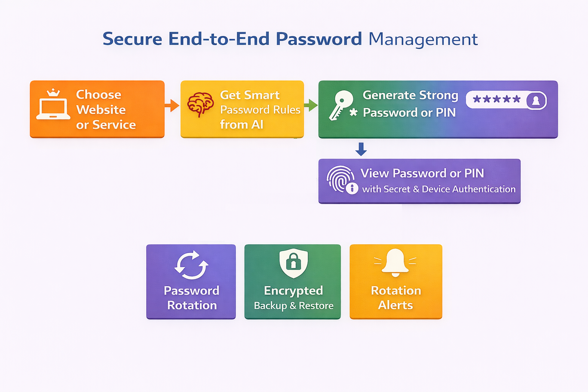

## Why UR-Vault?

UR-Vault has been built primarily to provide complete privacy and security with transparency. 
- No personal data is collected or stored by UR-Vault.
- No password or numeric pin that is generated for a website or service is stored.
- No data can be exported out of UR-Vault in plain text. 

### How is data stored?
- UR-Vault stores all the data on your device. The data is stored on the Android keystore. 

### What data is stored?
- Password or numeric pin generation settings are stored for every site that cannot be viewed again once generated.
- A hash of the secret is stored for every website or service for comparison during password or pin re-generation.

No password or numeric pin is stored. It is re-generated on demand provided the correct secret is provided and device authentication is successful.

### How is data security maintained during manual backup and restore?
The backup data exports the password or numeric pin generation settings in encryted format with an user provided encryption key.
The encryption key is again needed for decrypting and importing the data into UR-Vault.

### How can a password or pin for a particular website or service be viewed?
There are two levels of check before a password or pin can be viewed. After selecting the website or service for which the password or numeric pin is needed, the secret for the website or service specified during set up must be provided. In addition, the user will be prompted for device authentication before re-generating the pin or password. This prevents unauthorized access. Also, the password or numeric pin will be visible for only 20 seconds.

